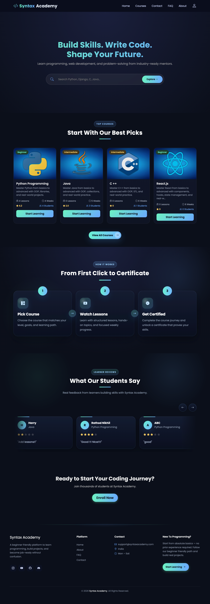
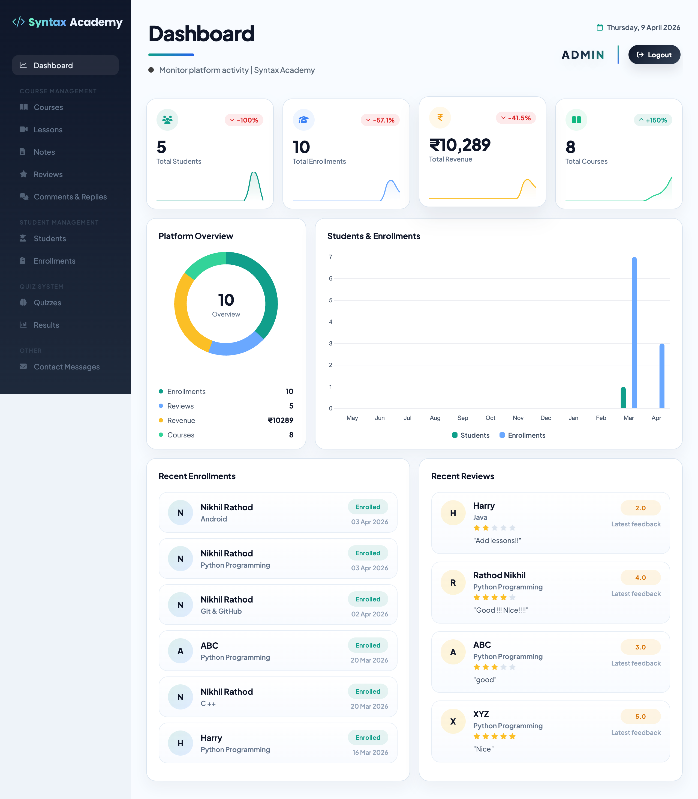
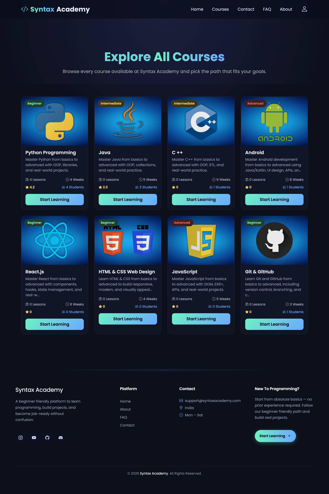

## Syntax Academy 2

## Project Description

Syntax Academy 2 is a Django-based e-learning platform providing course creation, lesson delivery (video + notes), quizzes, enrollment and basic payment flows. It includes an admin panel, public-facing course pages, and demo data to explore the app locally.

## Project Features

- **Course management:** Courses with lessons, notes, thumbnails, and levels (beginner → advanced).
- **Student registration:** Lightweight `Registration` model for students, with enrolment and lesson-tracking.
- **Quizzes & results:** Create quizzes per course and store results.
- **Payments (demo):** Payment model stores basic payment references; local seeds include example payments.
- **Admin panel:** Admin templates under `adminpanel/` for managing content.

## Setup Commands

```bash
# Clone the repository
git clone https://github.com/brainybeamGit/Syntax-Academy-2-Py.git

# Navigate to project directory
cd Syntax-Academy-2-Py
ls  # Verify manage.py is present

# Create virtual environment (macOS/Linux)
python3 -m venv .venv

# Create virtual environment (Windows)
python -m venv .venv

# Activate virtual environment (macOS/Linux)
source .venv/bin/activate

# Activate virtual environment (Windows)
.venv\Scripts\activate

# Install dependencies
pip install -r requirements.txt

# Copy environment variables
cp .env.sample .env
# Edit .env and fill in your SECRET_KEY, email, and Razorpay credentials

# Run database migrations
python manage.py migrate

# Populate the database with seed data
python manage.py shell < seeds.py

# Run development server
python manage.py runserver
```

## Default Server

- **Local Server:** `http://localhost:8000`

## Admin Credentials

| Field    | Value             |
|----------|-------------------|
| Username | `admin`           |
| Email    | `admin@gmail.com` |
| Password | `admin`           |

## Test User Credentials

| Role     | Identifier / Email       | Password      |
|----------|--------------------------|---------------|
| Student  | `ava@example.com`        | `demo123!`    |
| Student  | `noah@example.com`       | `demo123!`    |
| Student  | `mia@example.com`        | `demo123!`    |
| Student  | `liam@example.com`       | `demo123!`    |
| Student  | `sophia@example.com`     | `demo123!`    |

## Screenshots

### 1. Home Page


### 2. Dashboard


### 3. Courses


## Project Structure

- `manage.py` — Django management script
- `requirements.txt` — Python dependencies
- `seeds.py` — Project seeds script (creates admin + demo data)
- `db.sqlite3` — SQLite database (tracked in this repo)
- `media/` — Uploaded media (user files, course assets)
- `screenshot/` — Project screenshots (referenced in this README)
- `syn/` — Django project settings and WSGI/ASGI entry points
- `app1/` — Main application: models, views, templates, static
- `adminpanel/` — Admin UI and templates

### Key files

- `app1/models.py` — data models: `Course`, `Registration`, `Enrollment`, `Payment`, etc.
- `app1/views.py` — site views and page controllers
- `app1/templates/` — frontend templates (index, course, profile, quiz)
- `app1/static/` — frontend assets (css, js, images)

## Seeds and Database

- The `seeds.py` script creates the admin user and demo students, courses, quizzes, example payments and activity. It is idempotent and safe to re-run.
- This repository currently tracks `db.sqlite3` for convenience. Remove it and add to `.gitignore` if you do not want to track the database.

---

If you want me to push these README changes (and the repository) to GitHub, give me permission and I'll add the remote and push.
